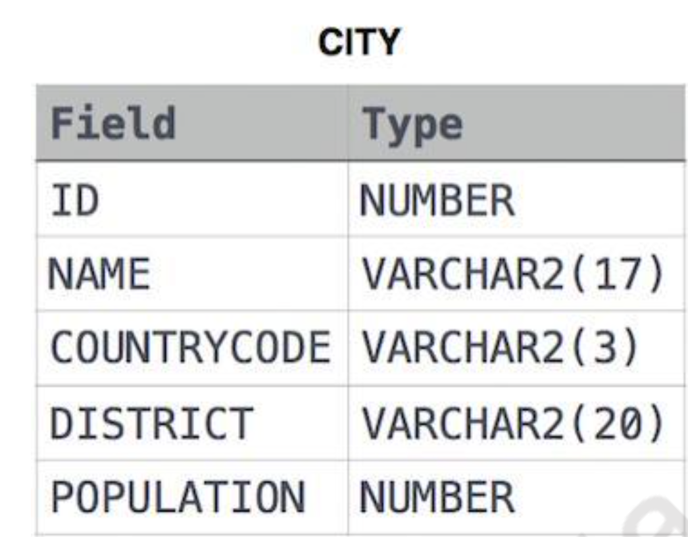

## SQL Assignment1


1.  Query all columns for all American cities in the CITY table with populations larger than 100000. The CountryCode for America is USA.
The CITY table is described as follows:



??? note "Answer"

    ### Creating the CITY Table

    ```sql
    CREATE TABLE CITY
    (
        ID INT,
        NAME VARCHAR(17),
        COUNTRYCODE VARCHAR(3),
        DISTRICT VARCHAR(20),
        POPULATION INT
    );
    ```


    This SQL command creates a table named CITY with columns ID (integer), NAME (varchar with a maximum length of 17 characters), COUNTRYCODE (varchar with a maximum length of 3 characters), DISTRICT (varchar with a maximum length of 20 characters), and POPULATION (integer).

    ### Describing the CITY Table

    ```sql
    DESCRIBE CITY;
    ```

    This command is used to display information about the structure of the CITY table, including the column names, data types, and any constraints.

    ### Inserting Data into the CITY Table

    ```sql
    INSERT INTO CITY VALUES
    (6, 'Rotterdam', 'NLD', 'Zuid-Holland', 593321),
    (3878, 'Scottsdale', 'USA', 'Arizona', 202705),
    -- (and additional rows)
    ;
    ```

    These commands insert data into the CITY table, providing values for the ID, NAME, COUNTRYCODE, DISTRICT, and POPULATION columns for each row.

    ### Selecting All Rows from the CITY Table

    ```sql
    SELECT * FROM CITY;
    ```

    This command retrieves all rows from the CITY table, displaying the values in all columns for each row.

    ### Filtering Rows Based on Conditions

    ```sql
    SELECT ID, NAME, COUNTRYCODE, DISTRICT, POPULATION
    FROM CITY
    WHERE COUNTRYCODE = 'USA' AND POPULATION > 100000;
    ```

    This query selects specific columns from the CITY table for rows where the COUNTRYCODE is 'USA' and the POPULATION is greater than 100,000.

    ### Alternative Query with Asterisk

    ```sql
    SELECT * FROM CITY WHERE COUNTRYCODE = 'USA' AND POPULATION > 100000;
    ```

    This is an equivalent query to the previous one, but it selects all columns using the asterisk (*) wildcard.


